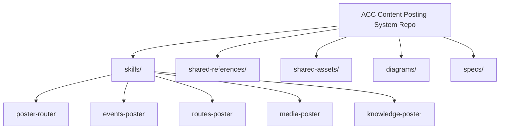
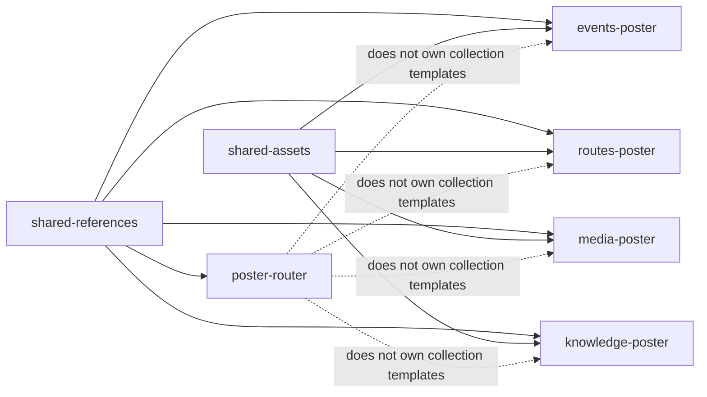
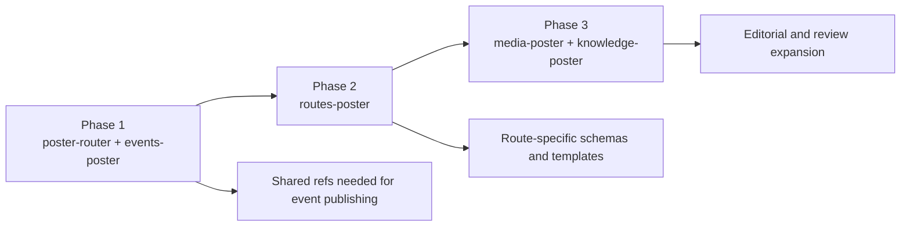

# ACC Content Posting System — Repository Spec v0.1

## Goal

Define the repository structure for the ACC Content Posting System so that:
- skill boundaries are explicit
- shared knowledge is centralized without becoming a dumping ground
- v1 implementation can start with `poster-router` + `events-poster`
- future extensions (`routes`, `media`, `knowledge`) do not require architectural rework

---

## Design principles

### 1. Collection-aligned skill boundaries
Each specialized posting skill maps to one ACC content collection family.

### 2. Thin router, thick specialists
`poster-router` performs triage, not deep schema logic.

### 3. Shared means truly shared
Only put something under `shared-references` or `shared-assets` if it is reused by multiple posting skills.

### 4. Progressive disclosure
Keep each SKILL.md lean. Put detailed schemas, templates, and governance in references/assets.

---

## Repository structure

```text
acc-content-posting-system/
├── skills/
│   ├── poster-router/
│   │   └── SKILL.md
│   │
│   ├── events-poster/
│   │   ├── SKILL.md
│   │   ├── references/
│   │   │   ├── event-frontmatter-schema.md
│   │   │   ├── event-body-structure.md
│   │   │   └── event-asset-rules.md
│   │   └── assets/
│   │       └── templates/
│   │           ├── event-post-template.md
│   │           └── event-gallery-section-template.md
│   │
│   ├── routes-poster/
│   │   ├── SKILL.md
│   │   ├── references/
│   │   │   ├── route-frontmatter-schema.md
│   │   │   ├── route-body-structure.md
│   │   │   └── route-asset-rules.md
│   │   └── assets/
│   │       └── templates/
│   │           └── route-post-template.md
│   │
│   ├── media-poster/
│   │   ├── SKILL.md
│   │   ├── references/
│   │   └── assets/
│   │
│   └── knowledge-poster/
│       ├── SKILL.md
│       ├── references/
│       └── assets/
│
├── shared-references/
│   ├── acc-repo-collections-overview.md
│   ├── multilingual-publishing-rules.md
│   ├── asset-naming-and-path-governance.md
│   ├── telegram-intake-conventions.md
│   └── content-status-and-review-rules.md
│
├── shared-assets/
│   ├── templates/
│   │   ├── multilingual-file-mapping-template.md
│   │   └── generic-review-checklist.md
│   └── placeholders/
│       └── placeholder-usage-notes.md
│
├── diagrams/
│   ├── system-overview.mmd
│   ├── system-priority-map.mmd
│   ├── repository-structure.mmd
│   ├── shared-boundary-map.mmd
│   └── phase-plan.mmd
│
└── specs/
    ├── repository-spec-v0.1.md
    └── phase-plan-v0.1.md
```

---

## What belongs in `shared-references`

Put reusable, cross-skill reference knowledge here.

Examples:
- ACC repo collection overview
- multilingual publishing rules
- asset naming and path governance
- Telegram intake conventions
- draft vs published review rules

Do **not** put collection-specific schemas here if only one skill uses them.

---

## What belongs in `shared-assets`

Put reusable output-side resources here.

Examples:
- generic review checklist template
- multilingual file mapping template
- shared placeholder usage notes

Do **not** put collection-specific markdown templates here if they are only used by one specialized skill.

---

## What stays inside each specialized skill

Keep these local to the skill:
- collection-specific frontmatter schema
- collection-specific body structure
- collection-specific asset rules
- collection-specific markdown template

This prevents shared directories from becoming a junk drawer.

---

## Phase plan

### Phase 1
Build:
- `poster-router`
- `events-poster`
- shared references needed by those two

### Phase 2
Build:
- `routes-poster`
- route-specific references and templates

### Phase 3
Build:
- `media-poster`
- `knowledge-poster`
- richer editorial / review helpers

---

## Mermaid diagrams

### Repository structure



### Shared boundary map



### Phase plan



---

## Current recommendation

Start the repository with the full target structure, but only fully flesh out:
- `poster-router`
- `events-poster`
- minimal shared references

Everything else can exist as a reserved folder / placeholder so the architecture is visible from day one.
