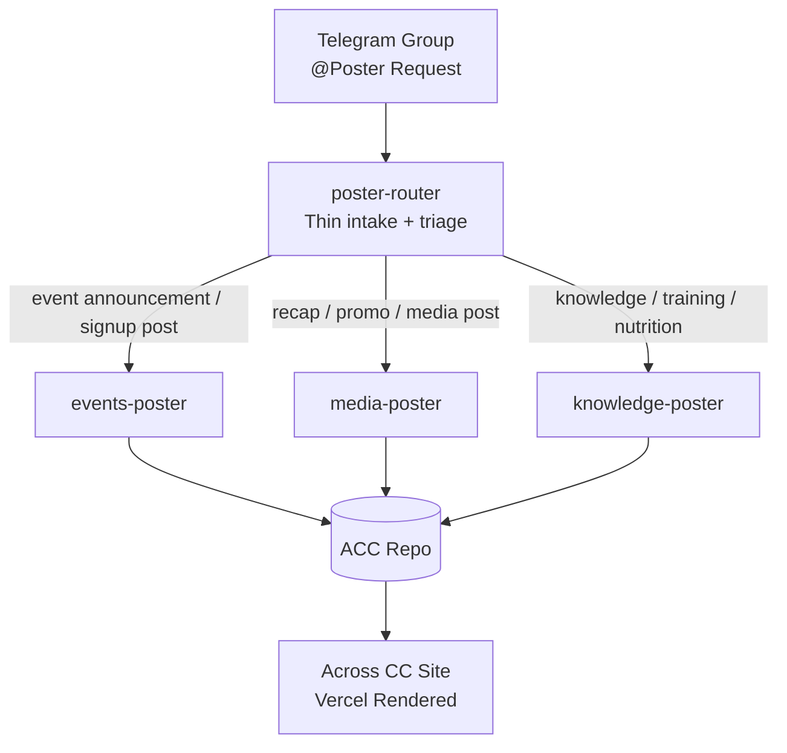
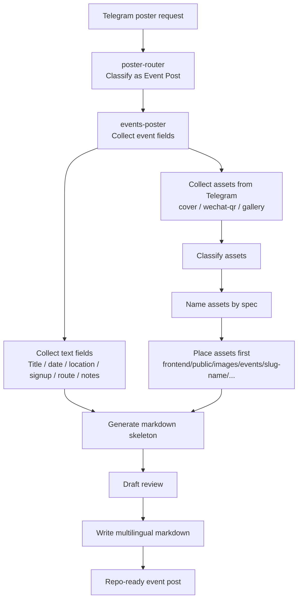

# Poster System v0.1

## Goal

Build a content publishing system for Across Cycling Club that starts from Telegram conversations and ends in repo-native Markdown + governed assets.

The system should not be a single giant "万能发帖 skill". It should be a thin routing layer plus specialized posting skills aligned with ACC content collections and asset rules.

---

## Design stance

### Why not one giant `poster-skill`

Because `events`, `media`, and `knowledge` have materially different:
- schemas
- question flows
- asset rules
- review criteria
- output structures

A single mega-skill would become prompt-heavy, hard to debug, and hard to extend.

### Why not only separate skills without a router

Because the Telegram entrypoint is fuzzy. Humans will say:
- "帮我发个活动"
- "把这次骑行整理一下发出来"
- "写一篇补给科普"

They will not reliably self-classify into `events` / `media` / `knowledge`.

### Chosen pattern

Use a **thin router** for intake and triage, and **specialized posting skills** for each content family.

---

## System components

### 1. `poster-router`

Role:
- accept Telegram-side poster requests
- identify target collection / post family
- perform minimal clarification if type is ambiguous
- hand off to the proper specialized posting skill
- reject / defer unsupported post types gracefully

Non-goals:
- do not own collection-specific schema logic
- do not become a second giant writing skill

### 2. `events-poster`

Role:
- own `Event Post` creation flow
- collect frontmatter + body skeleton fields
- manage event assets (`cover`, `wechat-qr`, `gallery/*`)
- write multilingual event markdown to the correct repo paths
- comply with `MAINTENANCE.md` and `docs/agent-posting-spec.md`

### 3. `media-poster`

Role:
- own post-event recap / media / promo publishing
- manage media-specific asset layouts and post body patterns
- support image/video-heavy publishing later

### 4. `knowledge-poster`

Role:
- own knowledge/training/nutrition content
- manage article-style structure and editorial flow
- support more research-heavy writing later

---

## v0.1 implementation strategy

### Logical architecture now
- `poster-router`
- `events-poster`
- `media-poster`
- `knowledge-poster`

### Actual implementation in phase 1
- fully implement: `events-poster`
- minimally implement: `poster-router`
- reserve interface only: `media-poster`, `knowledge-poster`

This gives us stable long-term boundaries without prematurely building three heavy skills.

---

## Event posting scope for phase 1

`events-poster` phase 1 should generate:
- frontmatter
- event body skeleton
- governed asset placement
- markdown references to those assets

### Required content layers
1. metadata/frontmatter
2. event narrative / opening paragraph
3. structured event facts block
4. participation / join instructions
5. optional return/logistics section
6. asset references

### Required event asset classes
- cover image
- wechat QR image
- gallery images

### Event asset rules
Per repo governance:
- cover: `/images/events/{slug}/cover.jpg`
- wechat QR: `/images/events/{slug}/wechat-qr.png`
- gallery: `/images/events/{slug}/gallery/01-descriptor.jpg`

And physically under:
- `frontend/public/images/events/{slug}/...`

---

## Skill repository recommendation

This poster architecture deserves its own skill repository because it contains:
- multi-skill orchestration
- repo-specific schema knowledge
- governed asset path conventions
- Telegram intake conventions
- reusable templates and future extension paths

### Suggested repository layout

```text
poster-system/
├── skills/
│   ├── poster-router/
│   │   └── SKILL.md
│   ├── events-poster/
│   │   ├── SKILL.md
│   │   ├── references/
│   │   │   ├── event-schema.md
│   │   │   ├── event-asset-governance.md
│   │   │   └── event-body-template.md
│   │   └── assets/
│   │       └── templates/
│   ├── media-poster/
│   │   └── SKILL.md
│   └── knowledge-poster/
│       └── SKILL.md
│
├── diagrams/
│   ├── system-overview.mmd
│   ├── event-flow.mmd
│   └── repo-mapping.mmd
│
└── specs/
    └── poster-system-v0.1.md
```

---

## Mermaid diagrams

### 1. System overview



### 2. Event posting flow (phase 1)



### 3. Repo mapping for event post

```mermaid
flowchart LR
    SUBGRAPH1[Telegram Inputs]
        T1[Event description]
        T2[Cover photo]
        T3[Wechat QR]
        T4[Gallery photos]
    end

    SUBGRAPH2[events-poster Output Mapping]
        M1[frontend/src/content/events/zh/slug-name.md]
        M2[frontend/src/content/events/en/slug-name.md]
        M3[frontend/src/content/events/de/slug-name.md]
        A1[frontend/public/images/events/slug-name/cover.jpg]
        A2[frontend/public/images/events/slug-name/wechat-qr.png]
        A3[frontend/public/images/events/slug-name/gallery/01-descriptor.jpg]
    end

    T1 --> M1
    T1 --> M2
    T1 --> M3
    T2 --> A1
    T3 --> A2
    T4 --> A3
```

---

## Phase-1 recommendation

### Build now
1. `poster-router` (thin)
2. `events-poster` (real)

### Do not fully build yet
1. `media-poster`
2. `knowledge-poster`
3. cross-posting / social distribution
4. autonomous publishing without review

---

## Open questions after architecture approval

1. Telegram-side approval authority model
2. multilingual generation strategy for events
3. draft vs publish write target
4. repo write mechanism (branch / PR / direct commit)
5. image role selection UX when multiple photos are uploaded
