# Media Poster Architecture

This document defines a more implementation-ready architecture for `media-poster` inside the ACC content posting system.

## Why the earlier version was incomplete

The earlier workflow sketch was too generic.
It did not anchor tightly enough to the **real ACC ClubHub media schema** or the actual rendering/runtime behavior of the media pages.

The improved architecture below is designed around the current ACC reality:

- router decides collection only
- `media-poster` must classify the **source shape** and **editorial intent**
- `media-poster` must normalize into the current ACC media frontmatter contract before drafting
- page framing depends on whether the piece is **video-led**, **recap-led**, **interview-led**, or **adventure-led**
- publish still stays behind preview + explicit approval

## Current ACC ClubHub media reality

The current media schema and runtime indicate that `media-poster` should think in these canonical fields first:

- `slug`
- `title`
- `description`
- `type`
- `date`
- `author`
- `featured`
- `cover`
- `tags`
- `videoUrl` (optional)
- `xiaohongshuUrl` (optional)
- `status`

And it must respect the current runtime behavior:

- media index page uses a **featured shelf** plus the normal media feed
- media detail page can render an embedded video when `videoUrl` is present
- body content still matters; link-only empty shells are not good enough

## Architecture diagram

```mermaid
flowchart TD
    U[Operator in Telegram] --> R[poster-router]
    R --> I{collection intent}
    I -->|event| E[events-poster]
    I -->|media| M[media-poster]
    I -->|knowledge| K[knowledge-poster]

    subgraph Intake [Media intake layer]
        M --> S1[Classify source shape]
        S1 --> A1[asset-led\nphotos / cover / raw media]
        S1 --> A2[link-led\nYouTube / Bilibili / Xiaohongshu]
        S1 --> A3[text-led\nrecap / interview / ride story]
        S1 --> A4[mixed brief\ntext + links + assets]

        M --> S2[Capture editorial intent]
        S2 --> B1[what is this piece?]
        S2 --> B2[one hero asset or story anchor]
        S2 --> B3[target media type]
        S2 --> B4[featured or normal shelf]
    end

    subgraph Normalize [Normalization against ACC ClubHub media schema]
        S2 --> N1[Normalize to canonical media fields]
        N1 --> F1[slug]
        N1 --> F2[title]
        N1 --> F3[description]
        N1 --> F4[type\nvideo / interview / adventure / group-ride]
        N1 --> F5[date]
        N1 --> F6[author]
        N1 --> F7[featured]
        N1 --> F8[cover]
        N1 --> F9[tags]
        N1 --> F10[videoUrl optional]
        N1 --> F11[xiaohongshuUrl optional]
        N1 --> F12[status draft/published]
    end

    subgraph Editorial [Editorial planning layer]
        N1 --> P0{Choose page framing}
        P0 -->|video-led| P1[video page\nwatch first, story second]
        P0 -->|recap-led| P2[group-ride recap\nstory first, assets support]
        P0 -->|interview-led| P3[interview page\nsubject first, media support]
        P0 -->|adventure-led| P4[adventure story\njourney first, links support]

        P1 --> Q1[Confirm plan with operator]
        P2 --> Q1
        P3 --> Q1
        P4 --> Q1
    end

    subgraph Draft [MediaDraft layer]
        Q1 --> D[MediaDraft object]
        D --> D1[core_fields]
        D --> D2[source_bundle]
        D --> D3[primary_asset]
        D --> D4[platform_links]
        D --> D5[body_structure_plan]
        D --> D6[asset_manifest]
        D --> D7[review_state]
        D --> D8[publish_targets]
    end

    subgraph Output [Draft outputs]
        D --> O1[markdown draft]
        D --> O2[preview package for Telegram]
        D --> O3[repo write set]
    end

    subgraph ReviewPublish [Review and publish gate]
        O2 --> G{explicit approval?}
        G -->|revise| Q1
        G -->|approved| W[Write media outputs]
        W --> T1[frontend/src/content/media/**]
        W --> T2[frontend/public/images/media/**]
    end

    subgraph RuntimeReality [ACC ClubHub runtime reality]
        X1[media index page\nfeatured shelf + masonry feed]
        X2[media detail page\noptional embedded video + article body]
        X3[type taxonomy must match real schema\nwatch docs/schema drift carefully]
    end

    W --> X1
    W --> X2
    N1 -.schema alignment.- X3

    subgraph Rules [Operating rules]
        R1[Router routes only\nno frontmatter decisions]
        R2[Find story anchor first\nnot every media post is video-led]
        R3[Normalize to real ACC schema\nbefore drafting body]
        R4[Preview first\npublish second]
        R5[Explicit approval required]
    end

    M --- R1
    M --- R2
    N1 --- R3
    O2 --- R4
    G --- R5
```

## Review conclusions

### 1. `media-poster` cannot just be `events-poster` with different field names

The center of gravity is different.
For events, the hard core is time / place / signup / route / section placement.
For media, the hard core is:

- what the piece is
- what the primary asset is
- what the editorial framing is
- whether it belongs in featured or normal feed

### 2. The workflow must explicitly separate **source-shape classification** from **editorial framing**

These are different decisions.
A YouTube link does not automatically mean a video-led page.
A gallery of images does not automatically mean the piece should be a pure gallery.
The operator may still want a recap-led or interview-led page with media as support.

### 3. Normalization must happen before body drafting

This is the part the first draft underemphasized.
Before the body is expanded, `media-poster` should already know the target frontmatter contract it is aiming for.
Otherwise the final page structure will drift away from what ACC ClubHub can really render and filter.

### 4. Type taxonomy needs active attention

There is already some schema/document drift in ACC ClubHub media references.
For example, some docs/templates still mention `gallery`, while the current runtime/schema examples also use `group-ride`.
So `media-poster` should be designed to align to the **actual current schema**, not blindly trust a stale template.

## Practical design implications for the future skill

When we turn this architecture into the real `media-poster` skill, the skill should contain at least:

- media intake question flow
- media draft schema example
- media frontmatter schema reference
- media body structure families
- media publish step spec
- router-to-media handoff reference

And the future workflow should explicitly ask just enough to determine:

- source shape
- story anchor / hero asset
- target media type
- featured vs non-featured
- required links / cover / tags

Not everything at once.
