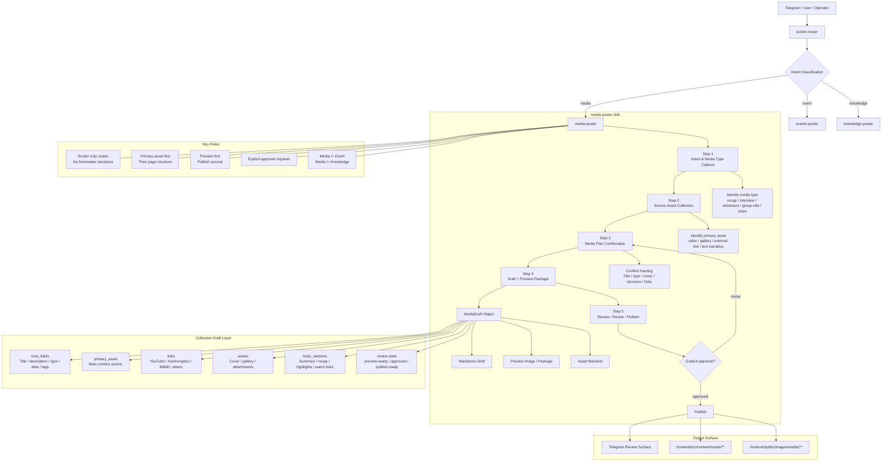

# Media Poster Architecture

This diagram shows the high-level architecture and workflow of `media-poster` inside the ACC content posting system.

```mermaid
flowchart TD
    U[Telegram / User / Operator] --> R[poster-router]

    R --> C1{Intent Classification}
    C1 -->|event| E[events-poster]
    C1 -->|media| M[media-poster]
    C1 -->|knowledge| K[knowledge-poster]

    subgraph MediaPosterSkill [media-poster skill]
        M --> M1[Step 1\nIntent & Media Type Capture]
        M1 --> M2[Step 2\nSource Asset Collection]
        M2 --> M3[Step 3\nMedia Plan Confirmation]
        M3 --> M4[Step 4\nDraft + Preview Package]
        M4 --> M5[Step 5\nReview / Revise / Publish]

        M1 --> T1[Identify media type\nrecap / interview / adventure / group-ride / video]
        M2 --> T2[Identify primary asset\nvideo / gallery / external link / text narrative]
        M3 --> T3[Confirm framing\nTitle / type / cover / structure / links]
        M4 --> D[MediaDraft Object]
        D --> P1[Markdown Draft]
        D --> P2[Preview Image / Package]
        D --> P3[Asset Manifest]
        M5 --> G{Explicit approval?}
        G -->|revise| M3
        G -->|approved| PUB[Publish]
    end

    subgraph DraftModel [Collection Draft Layer]
        D --> DF1[core_fields\nTitle / description / type / date / tags]
        D --> DF2[primary_asset\nMain content anchor]
        D --> DF3[links\nYouTube / Xiaohongshu / Bilibili / others]
        D --> DF4[assets\nCover / gallery / attachments]
        D --> DF5[body_sections\nSummary / recap / highlights / watch links]
        D --> DF6[review state\npreview-ready / approved / publish-ready]
    end

    subgraph OutputSurface [Output Surface]
        PUB --> O1[Telegram Review Surface]
        PUB --> O2[frontend/src/content/media/**]
        PUB --> O3[frontend/public/images/media/**]
    end

    subgraph Rules [Key Rules]
        R1[Router only routes\nNo frontmatter decisions]
        R2[Primary asset first\nThen page structure]
        R3[Preview first\nPublish second]
        R4[Explicit approval required]
        R5[Media != Event\nMedia != Knowledge]
    end

    M --- R1
    M --- R2
    M --- R3
    M --- R4
    M --- R5
```
