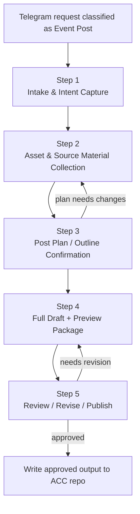

# Event Phase 1 User Flow

This spec is intended for both internal implementation and human communication with ACC teammates.

## Core principle

For an `Event Post`, the agent should first tell the user the full five-step workflow, then proceed one step at a time.

It should not jump ahead to later-step questions before the current step is sufficiently complete.

## User-visible workflow

1. Intake & Intent Capture
2. Asset & Source Material Collection
3. Post Plan / Outline Confirmation
4. Full Draft + Preview Package
5. Review / Revise / Publish

## Mermaid flowchart

## Interaction rule

When the agent enters the event workflow, it should explicitly tell the user:

> 好的。接下来我们需要完成 5 步：
> 1. Intake & Intent Capture
> 2. Asset & Source Material Collection
> 3. Post Plan / Outline Confirmation
> 4. Full Draft + Preview Package
> 5. Review / Revise / Publish
>
> 我们先完成第 1 步，再进入下一步。

## Step discipline

### Step 1
Only ask event-core questions.
Do not start asking about final gallery usage or full post structure yet.

### Step 2
Focus on collecting and clarifying images, QR, route links, video links, and supporting materials.
Do not generate the post plan yet.

### Step 3
Show the post plan / outline and get explicit confirmation.
Do not generate the full draft before confirmation.

### Step 4
Generate the full draft and preview package only after Step 3 confirmation.

### Step 5
Use Telegram review as the formal gate.
Only after approval may the system write to the ACC repo.

## Implementation note

For skill execution reliability:
- keep numbered workflow steps in `SKILL.md`
- use Mermaid diagrams in specs/docs for human review and communication
- do not rely on Mermaid alone as the primary execution instruction
